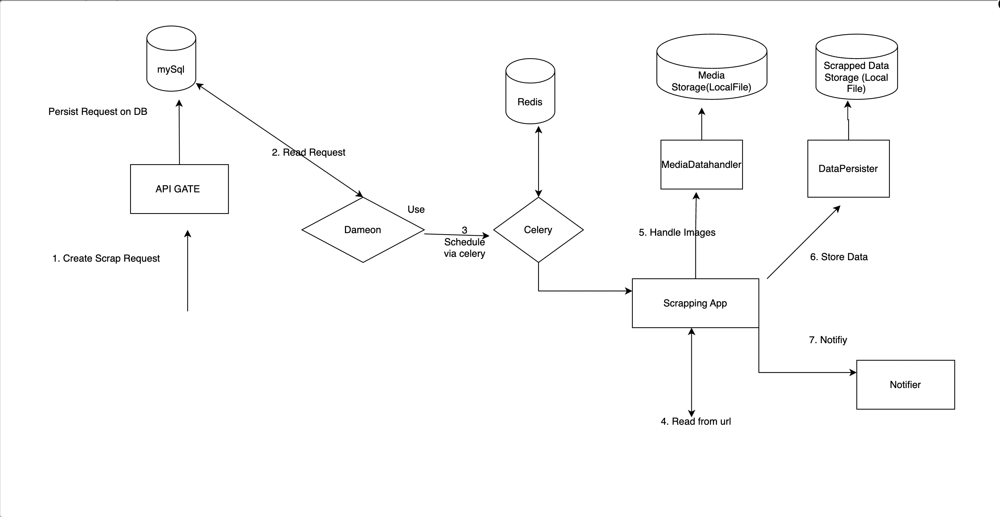

## Description
1. **API Specification**: 
   - Create an API that accepts a scrap request with the following information:
     - **User**: The individual initiating the request.
     - **Page URL**: The URL of the page to be scraped.
     - **Configuration**:
       - **Page Numbers**: The specific pages to scrape.

2. **Daemon Process**:
   - Implement a daemon process that runs a Scraping Scheduler using **ScrappingSchedular**, which will manage the scheduling of scraping jobs based on the created requests:
     - **New Requests**: Schedule scraping jobs when new requests are created.
     - **Failed Requests**: Retry failed scraping requests that have a retry count below a specified threshold and have surpassed their retry delay period.

3. **Scraping Job Execution**:
   - The scraping job will be executed on a Celery worker by **ScrappingApp** class. During the job, it will:
     - Retrieve data from the specified URL using **PageScrapper**.
     - Download any images and upload them to a media destination, ensuring the URL paths are saved via **MediaDataManager**.
     - Store the scraped data in the desired location along with the media URLs via  **DataPersister**.
     - Upon successful completion, notify the user according to their preferences via **Notifier** and update the status of the request.
     - In case of failure, update the status with the incremented retry count.

## HLD

## UML

**The folder scrapped_data and test.db and  their data are just for demo.**